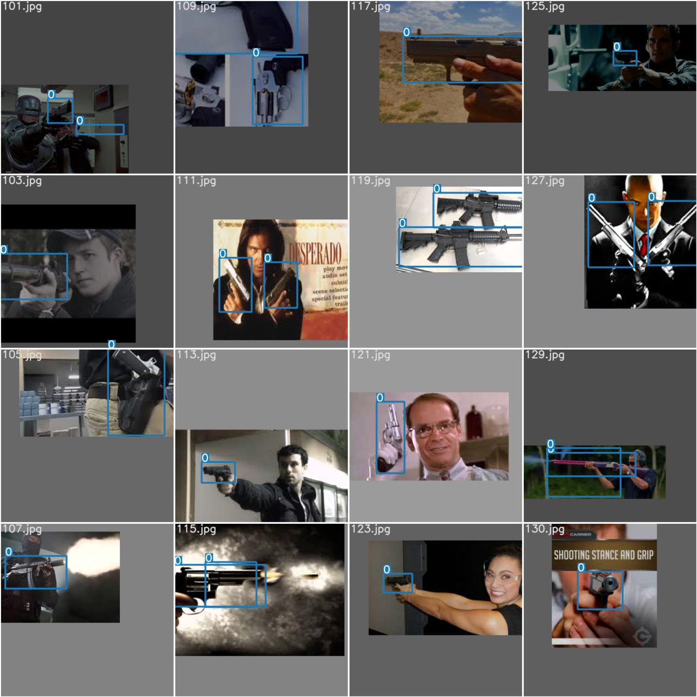
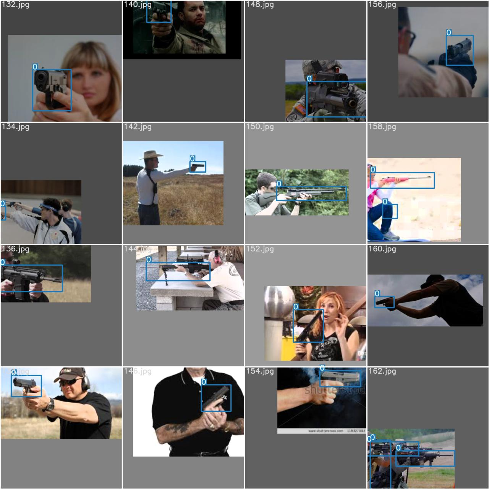
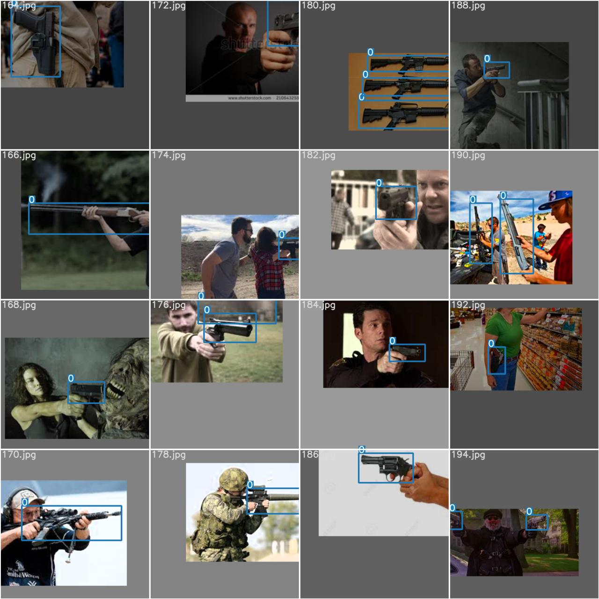
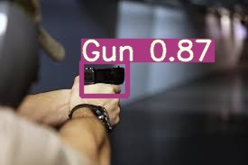
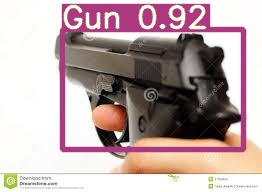
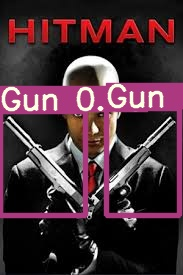
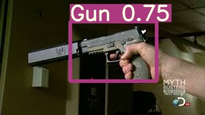
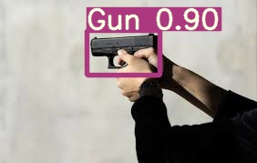
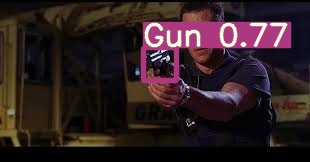

# ml-model-gun-detector
# yolov5s for detecting guns in images

### Description

_Purpose_: Detecting guns present in the image; 

_Input_: Normal image containing Gun.

_Output_: Valid classes: 'Gun'

_Sample inputs:_ with augmentations 'hsv_h': 0.015, 'hsv_s': 0.7, 'hsv_v': 0.4,'translate': 0.3, 'scale': 0.1 

  

All these augmentations are applied on letter box resizing due to variation in the size of object class "Gun"

## Data Preparation
  1. Removed the images which don't have annotations 
  2. Converted annotations into standard yolo format
    
  Data Extraction: data is extracted along with labels from https://www.kaggle.com/issaisasank/guns-object-detection
    
## Training data 

In current dataset contains 330 training images and trained with 512*512 dimensions 

 Train Dataset | Validation dataset| Test | Epochs|
| --- | --- |  --- |--- |
| 330| 30| 30 |50 |

## Training instructions 

  1.Change directory to dev/yolov5/
  
  2.install dependencies using !pip install -r requirments.txt
  
  3.Create data.yaml file which containes train,val and test training images and labels  
  
      train : data/data/train/images
      
      val : data/data/val/images
      
      test : data/data/test/images
      
      nc : 1
      
      names: ["Gun"] 
   
  4.Check defaults parameters in train.py and specify any parameters you want to it be different.

  5.Run $ python train.py --img 512 --batch 8 --epochs 40 --data data.yaml --weights yolov5s.pt

### Current performance metrics v0.0

 
Following are the results on test data with confidence score>0.4

| _Per class_ |precision    |recall  |map@0.5  |map@0.95 | total no of images |
| --- | --- | --- | --- | --- | ---
| 'Gun' | 0.85 | 0.9 | 0.91 |0.552 | 28 |

### Prediction results
_Sample result:_

  

  

